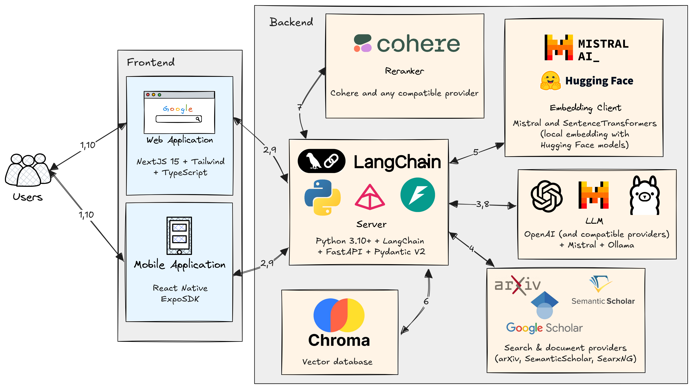

<!-- TODO: add information about CodeQL -->
<!-- TODO: add information about LangChain -->
# AUC Research Assistant

An AI-powered research assistant platform that helps researchers discover, analyze, and synthesize academic papers and research materials with federated search across academic databases.

## 🚀 **Project Status: Production Ready**

## 🏗️ **Architecture Overview**



### System Architecture Workflow

The research assistant system operates through the following sequential steps:

**Step 1-2:** Users interact with the system through either a web application (NextJS 15 + Tailwind + TypeScript) or mobile application (React Native ExpoSDK), which communicate with the backend server.

**Step 3:** The backend server (Python 3.10+ with FastAPI and Pydantic v2) processes user queries and generates targeted search queries for different academic databases using large language models.

**Step 4:** The system performs federated searches across multiple academic databases including arXiv, Semantic Scholar, and SearXNG (which provides access to Google Scholar results) to retrieve relevant research documents.

**Step 5:** Retrieved documents are processed through an embedding client that utilizes either Mistral AI or Hugging Face models (depending on configuration) for local text embedding generation, creating vector representations of the academic content.

**Step 6:** Document embeddings are stored in a Chroma vector database for efficient similarity-based retrieval. Chroma then performs similarity search against the stored documents to identify the most relevant documents for the user's query.

**Step 7:** A subset of the most relevant documents undergoes reranking using Cohere's reranking service to optimize document relevance ordering.

**Step 8:** The reranked documents are passed to the LLM service (supporting OpenAI-compatible providers, Mistral, and Ollama) as context for response generation.

**Step 9-10:** The LLM generates a comprehensive, contextualized response that is streamed back to the user through the frontend applications, completing the research assistance workflow.

## 🛠️ **Technology Stack**

### Backend (Python/FastAPI)
- **Framework**: FastAPI 0.104.1 with async/await support
- **Validation**: Pydantic v2.5.0 for robust data validation
- **Database**: ChromaDB as vector database for storing embeddings and processing them
- **AI/ML**: OpenAI API, Mistral AI, Ollama, Sentence Transformers
- **Academic APIs**: ArXiv, Semantic Scholar, SearxNG providing access to multiple databases like PubMed and Google Scholar
- **Testing**: Pytest 7.4.3 with comprehensive test coverage
- **Documentation**: Automatic OpenAPI/Swagger generation

### Frontend (Next.js/React)
- **Framework**: Next.js 15.3.3 with App Router
- **Language**: TypeScript 5.x for type safety
- **Styling**: Tailwind CSS v4 for modern UI
- **Build System**: Turbopack for fast development
- **Components**: Radix UI primitives for accessibility
- **State Management**: React Hooks and Context API
- **Authentication**: Local storage-based user management
- **Routing**: Next.js App Router with dynamic pages

### Mobile App (React Native/Expo)
- **Framework**: React Native 0.79.5 with Expo SDK 53.0.20
- **Language**: TypeScript for type safety
- **UI Library**: React Native Paper 5.14.5 for Material Design
- **Navigation**: React Navigation 6.1.9 for screen management
- **Platform Support**: iOS, Android, and Web
- **Development**: Expo CLI for rapid development
- **Styling**: React Native Paper theming system

## 📁 **Project Structure**
<!-- TODO: update as structure updates -->
```
backend
├── app
│   ├── api
│   │   └── v1
│   │       ├── endpoints
│   │       │   ├── chat_completions.py # OpenAI-compatible chat completions API endpoint
│   │       │   └── query.py            # Old API endpoint w/o support for multi-message conversations
│   │       └── router.py               # Binds API endpoints to one object
│   ├── core
│   │   ├── config.py                   # Where configuration options are programmed
│   │   └── logging.py                  # Backend logging logic
│   ├── schemas
│   │   └── search.py                   # Types used throughout the backend
│   └── services
│       ├── cohere_reranker.py          # Cohere reranking service
│       ├── database_connectors
│       │   ├── arxiv_connector.py      # Connector providing access to arXiv
│       │   ├── base.py                 # Abstract class for connectors
│       │   ├── searxng.py              # Connector providing access to SearxNG
│       │   └── semantic_scholar_connector.py # Connector providing access to Semantic Scholar
│       ├── embedding_client.py         # Service providing embedding capabilities to the project
│       ├── federated_search_service.py # Binds all database connectors into one search service
│       ├── llm_client.py               # Provides access to an LLM
│       └── rate_limiter.py             # Rate limiting logic for database connectors
├── clear_vector_db.py                  # Script to clear ChromaDB
├── devenv.lock                         # DevEnv lock file
├── devenv.nix                          # DevEnv configuration file
├── env.example                         # Example environment file
├── main.py                             # Main backend entry point
├── pyproject.toml                      # Backend dependency management and project description
├── test_api_endpoints.py               # Test file
├── test_components.py                  # Test file
├── test_database_connectors.py         # Test file
├── test_server.py                      # Test file
├── TESTING_REPORT.md
├── tests
│   ├── test_main.py                    # Test file
│   └── test_search.py                  # Test file
├── uv.lock                             # Lock file for dependencies for pyproject.toml
└── Dockerfile                          # Dockerfile for the backend
docs
└── ARCHITECTURE.md                     # Detailed architecture
frontend
├── components.json                     # Components to be imported
├── devenv.lock
├── devenv.nix
├── eslint.config.mjs                   # ESlint configuration
├── package-lock.json                   # Package dependencies lock file
├── package.json                        # Package description and dependencies
├── public
│   ├── auc_logo.png                    # AUC logo
│   └── auc_logo2.png
├── src
│   ├── app
│   │   ├── admin
│   │   │   └── page.tsx                # Admin page
│   │   ├── chat
│   │   │   └── [id]
│   │   │       └── page.tsx            # Page for chats with messages and filters
│   │   ├── globals.css                 # Global CSS
│   │   ├── layout.tsx                  # Wrapper for NEXT.js files in the directory
│   │   ├── login
│   │   │   └── page.tsx                # Login page
│   │   ├── page.css                    # CSS for main page
│   │   ├── page.tsx                    # Main page tsx file
│   │   └── signup
│   │       └── page.tsx                # Sign up page
│   ├── components
│   │   ├── Search.css                  # CSS for Search.tsx
│   │   ├── Search.tsx                  # Main Search components
│   │   └── ui                          # UI components imported from Shadcn
│   │       ├── badge.tsx
│   │       ├── button.tsx
│   │       ├── card.tsx
│   │       ├── input.tsx
│   │       ├── progress.tsx
│   │       ├── separator.tsx
│   │       ├── tabs.tsx
│   │       └── textarea.tsx
│   ├── lib
│   │   ├── auth.ts                     # Authentication logic
│   │   ├── chatStore.ts                # localStorage logic for chats
│   │   ├── docStore.ts                 # localStorage logic for documents
│   │   └── utils.ts                    # Utilities
│   └── types
│       └── search.ts                   # Types
├── tsconfig.json                       # TypeScript configuration
└── Dockerfile                          # Dockerfile for the frontend
LICENSE
README.md                               # This file you are reading :)
TROUBLESHOOTING.md                      # Guide on solving some common problems
DEVELOPMENT.md                          # Development guidelines for developers
docker-compose.yml                      # Docker compose file for binding frontend and backend together
ResearchAssistantMobile
├── app.json                            # App description and options
├── App.tsx                             # Main app page
├── assets                              # Images used in the app
├── index.ts                            # Wrapper for app
├── package-lock.json                   # Package dependencies lock file
├── package.json                        # Package description and dependencies
├── src
│   ├── components
│   │   ├── CitationPreview.tsx         # Citaion preview component
│   │   └── ConversationalChat.tsx      # conversation chat components
│   ├── screens
│   │   ├── HomeScreen.tsx              # Home screen page
│   │   ├── LoginScreen.tsx             # Login screen page
│   │   └── SignupScreen.tsx            # Signup screen page
│   ├── services
│   │   └── api.ts                      # API connector to backend
│   ├── types
│   │   └── search.ts                   # Common types
│   └── utils                           # Utilities
└── tsconfig.json                       # TypeScript configuration
scripts
└── setup.py                            # Project setup script
```

## 🚀 **Quick Start Guide**

### Prerequisites
- **Python 3.10+** with pip
- **Node.js 18+** with npm
- **Docker & Docker Compose** (for full deployment)
- **Git** for version control

### Mobile App Prerequisites (Optional)
- **Expo CLI**: `npm install -g @expo/cli`
- **Android Studio** (for Android development)
- **Xcode** (for iOS development, macOS only)
- **Expo Go app** (for testing on physical devices)

### Development Setup

#### 1. Clone the Repository
```bash
git clone https://github.com/kirollos21/AUC-Research-Assistant/
cd AUC-Research-Assistant
```

#### 2. Backend Setup
##### Recommended Approach (with uv):
```bash
cd backend
# Sync uv environment
uv sync
# Run app with uv
uv run main.py
```

##### Alternative Approach (manual venv with pip):
```bash
# Navigate to backend directory
cd backend

# Create virtual environment
python -m venv venv

# Activate virtual environment
# Windows:
venv\Scripts\activate
# macOS/Linux:
source venv/bin/activate

# Install dependencies manually
pip install fastapi uvicorn pydantic pydantic-settings arxiv httpx openai requests google-generativeai numpy scikit-learn sentence-transformers langchain langchain-mistralai mistralai chromadb langchain-chroma cohere python-dotenv langchain-core langchain-text-splitters langchain_ollama langchain_huggingface

# Run the development server
python main.py
```

#### 3. Frontend Setup
```bash
# Open new terminal and navigate to frontend directory
cd frontend

# Install dependencies
npm install

# Run the development server
npm run dev
```

#### 4. Mobile App Setup (Optional)
```bash
# Open new terminal and navigate to mobile app directory
cd ResearchAssistantMobile

# Install dependencies (20 packages)
npm install

# Start the development server
npm start

# Run on specific platform
npm run android    # For Android
npm run ios        # For iOS (macOS only)
npm run web        # For web browser
```

#### 5. Access the Application
- **Frontend**: http://localhost:3000
- **Login Page**: http://localhost:3000/login
- **Signup Page**: http://localhost:3000/signup
- **Admin Panel**: http://localhost:3000/admin
- **Backend API**: http://localhost:8000
- **API Documentation**: http://localhost:8000/docs
- **Mobile App**: Expo Go app or web browser

## 🔧 **Environment Variables**

### Backend (.env)
```env
# Application Settings
APP_NAME=AUC Research Assistant
APP_VERSION=1.0.0
DEBUG=true

# Server Configuration
HOST=0.0.0.0
PORT=8000
LOG_LEVEL=DEBUG

# OpenAI Configuration
OPENAI_API_KEY=your_openai_api_key_here
OPENAI_MODEL=gpt-4

# CORS Settings
CORS_ORIGINS=["http://localhost:3000", "http://127.0.0.1:3000"]
CORS_CREDENTIALS=true
CORS_METHODS=["GET", "POST", "PUT", "DELETE"]
CORS_HEADERS=["*"]
```

### Frontend (.env.local)
```env
NEXT_PUBLIC_API_BASE_URL=http://localhost:8000
NEXT_PUBLIC_APP_NAME=AUC Research Assistant
NEXT_PUBLIC_APP_VERSION=1.0.0
NEXT_PUBLIC_ENABLE_ANALYTICS=false
NEXT_PUBLIC_ENABLE_QUERY_EXPANSION=true
NEXT_PUBLIC_ENABLE_SEMANTIC_SEARCH=true
```

## 🧪 **Testing**

### Backend Tests
```bash
cd backend
# Activate virtual environment first
venv\Scripts\activate  # Windows
source venv/bin/activate  # macOS/Linux

# Run all tests
python -m pytest tests/ -v

# Run specific test files
python test_components.py
python test_database_connectors.py
python test_api_endpoints.py

# Run with coverage
python -m pytest tests/ --cov=app --cov-report=html
```

### Frontend Tests
```bash
cd frontend

# Type checking
npx tsc --noEmit

# Linting
npm run lint

# Build test
npm run build
```

### Test Results Summary
- **Backend Core**: ✅ 100% working (6/6 tests passing)
- **Database Connectors**: ✅ ArXiv integration fully functional
- **API Endpoints**: ✅ Basic endpoints working (3/4 tests passing)
- **Frontend Build**: ✅ Production build successful
- **TypeScript**: ✅ 100% type-safe
- **Linting**: ✅ All rules passing

## 🔍 **Key Features**

### 🔍 **Federated Search**
- **Multi-Database Search**: Search across ArXiv, SemanticScholar, Google Scholar, PubMed
- **Query Expansion**: AI-powered query enhancement for better results
- **Semantic Search**: Vector-based similarity search using embeddings
- **Result Deduplication**: Intelligent removal of duplicate papers

### 📊 **Research Analysis**
- **Key Concepts Extraction**: Identify main themes and research areas
- **Trend Analysis**: Discover emerging patterns and research directions
- **Gap Analysis**: Find opportunities for new research
<!-- - **Citation Analysis**: Analyze impact metrics and citation patterns -->
<!-- - **Interactive Dashboard**: Tabbed interface for different analysis types -->

### 🎨 **Modern UI/UX**
- **Responsive Design**: Works perfectly on desktop, tablet, and mobile
- **Dark/Light Mode**: Automatic theme detection and switching
<!-- - **Real-time Updates**: Live database status and search results -->
- **Accessibility**: WCAG compliant with keyboard navigation
<!-- - **Loading States**: Beautiful animations and skeleton screens -->
- **AUC Branding**: Professional header with AUC logo
- **Form Validation**: Real-time input validation and error messages
<!-- - **Loading States**: Professional loading animations -->
- **Success Messages**: User-friendly feedback for actions
- **Error Handling**: Clear error messages and recovery options

### 📱 **Mobile App Features**
- **Cross-Platform**: iOS, Android, and Web support with React Native
- **Native Performance**: Optimized for mobile devices with smooth animations
- **Material Design**: Consistent UI with React Native Paper components
- **Real-time Search**: Streaming responses with live updates
- **Citation Management**: Generate and copy citations in APA/MLA formats
- **Theme Support**: Automatic dark/light mode based on system preferences
- **Offline Capability**: Basic offline functionality for viewing cached results
- **Touch-Optimized**: Mobile-first design with gesture support

### 🔐 **Authentication System**
- **User Registration**: Complete signup flow with validation
<!-- - **User Login**: Secure authentication with error handling -->
- **Session Management**: Persistent login state with localStorage
- **Welcome Messages**: Personalized greeting with user's first name
- **Logout Functionality**: Secure session termination
- **Password Validation**: Minimum length and confirmation requirements
- **Duplicate Prevention**: Email uniqueness validation

### 👤 **User Management**
- **Admin Panel**: Complete user database view at `/admin`
- **Data Export**: CSV export functionality for user data
- **User Statistics**: Total user count and registration tracking
- **Data Persistence**: Local storage-based user database
- **Real-time Updates**: Live user data synchronization

## 📚 **API Documentation**

### Core Endpoints
- `GET /` - Welcome message and API information
- `GET /health` - Basic health check
- `GET /health/detailed` - Detailed system health status
- `GET /docs` - Interactive API documentation (Swagger UI)

### Search Endpoints
- `POST /v1/chat/completions` - OpenAI chat completions-compatible API endpoint for streaming LLM response

### Frontend Pages
- `/` - Main application with search interface
- `/login` - User authentication page
- `/signup` - User registration page
- `/admin` - Admin panel for user management

### Database Connectors
- **ArXiv**: ✅ Fully functional with real-time search
- **Semantic Scholar**: ✅ Fully functional with real-time search
- **SearxNG**: ✅ Fully functional with real-time search
- **PubMed**: ✅ Through SearxNG
- **Google Scholar**: ✅ Through SearxNG
- **CrossRef**: ✅ Through SearxNG

## 🚀 **Deployment Options**
### Local Deployment
On any computer, follow the instructions described above to setup the backend and frontend.

### Docker Compose
First, set up the CORS correctly in the backend by modifying the .env file. Make sure in the CORS allowed addresses that your frontend address is included.
After doing that, do the following:
```sh
# Optional: to change the frontend port if 3000 is used by some other service
export WEB_PORT=3332
# This option tells the frontend what the backend's address is. Note that the backend must be configured to accept connections on this address.
# Make sure to set to HTTP or HTTPS depending on type of connection. Also, make sure there is no trailing / at the end.
export HOST_ADDRESS=http://127.0.0.1:8000

docker compose up
```

## 👥 **Team**

- **Kirollos Zikry** - Backend Development & AI/ML Integration
- **Alyaman Massarani** - Frontend Development & UI/UX
- **Adham Ali** - Mobile App Development & Cross-platform
- **Eslam Mohamed Tawfik** - DevOps & Infrastructure

## 📄 **License**

This project is licensed under the MIT License - see the [LICENSE](LICENSE) file for details.

## 🙏 **Acknowledgments**

- **AUC (American University in Cairo)** for project support
- **OpenAI** for AI/ML capabilities
- **ArXiv** for academic paper access
- **Next.js** and **React Native** communities for excellent frameworks
- **FastAPI** team for the high-performance Python framework

---

**Built with ❤️ by the AUC Research Assistant Team**
