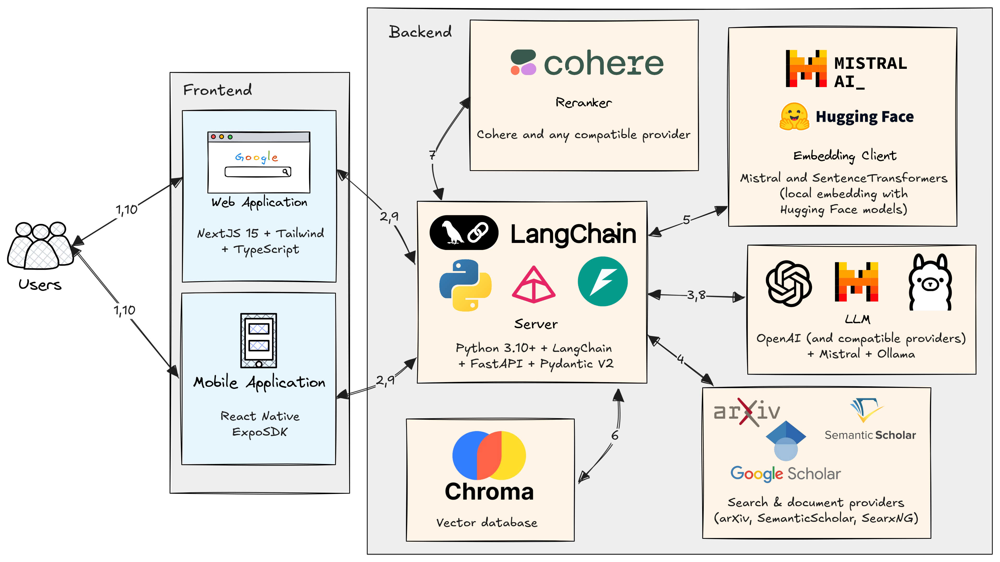

<!-- TODO: Maybe add more technical decisions -->
<!-- TODO: Why is this in /docs/ while the rest of md files are in /? -->
# Architecture Decision Record (ADR)

## Backend Technology Stack Decision

### Status
**ACCEPTED** - December 2024

### Context
We needed to choose a backend technology stack for the AUC Research Assistant that would support:
- AI/ML workloads (LLM integration, embeddings, document processing)
- High-performance API development
- Integration with Next.js frontend
- Scalable architecture for research data processing
- Strong type safety and development experience

### Options Considered

#### Option 1: Python with FastAPI
**Pros:**
- Excellent AI/ML ecosystem (OpenAI, LangChain, transformers, spaCy)
- FastAPI provides high performance with async support
- Strong typing with Pydantic models
- Automatic OpenAPI/Swagger documentation
- Rich ecosystem for document processing and vector databases
- Team expertise in Python for AI/ML development

**Cons:**
- Potentially slower than Node.js for pure I/O operations
- Requires separate runtime from frontend

#### Option 2: Node.js with Express/Fastify
**Pros:**
- Unified JavaScript/TypeScript ecosystem with frontend
- Excellent performance for I/O-heavy operations
- Large ecosystem and community
- Real-time capabilities with WebSockets

**Cons:**
- Limited AI/ML ecosystem compared to Python
- Would require Python services for AI processing anyway
- Less mature libraries for document processing and embeddings

#### Option 3: Hybrid Approach
**Pros:**
- Best of both worlds
- Node.js API gateway with Python microservices for AI

**Cons:**
- Increased complexity
- More deployment overhead
- Overkill for initial development

### Decision
**We chose Python with FastAPI** for the following reasons:

1. **AI/ML Excellence**: Python is the de facto standard for AI/ML with mature libraries
2. **Performance**: FastAPI is one of the fastest Python frameworks with async support
3. **Developer Experience**: Excellent tooling, type hints, and automatic documentation
4. **Ecosystem Fit**: Perfect alignment with our AI-heavy requirements
5. **Simplicity**: Single backend service reduces operational complexity

### System Architecture

#### System Architecture Workflow

The research assistant system operates through the following sequential steps:

**Step 1-2:** Users interact with the system through either a web application (NextJS 15 + Tailwind + TypeScript) or mobile application (React Native ExpoSDK), which communicate with the backend server.

**Step 3:** The backend server (Python 3.10+ with FastAPI and Pydantic v2) processes user queries and generates targeted search queries for different academic databases using large language models.

**Step 4:** The system performs federated searches across multiple academic databases including arXiv, Semantic Scholar, and SearXNG (which provides access to Google Scholar results) to retrieve relevant research documents.

**Step 5:** Retrieved documents are processed through an embedding client that utilizes either Mistral AI or Hugging Face models (depending on configuration) for local text embedding generation, creating vector representations of the academic content.

**Step 6:** Document embeddings are stored in a Chroma vector database for efficient similarity-based retrieval. Chroma then performs similarity search against the stored documents to identify the most relevant documents for the user's query.

**Step 7:** A subset of the most relevant documents undergoes reranking using Cohere's reranking service to optimize document relevance ordering.

**Step 8:** The reranked documents are passed to the LLM service (supporting OpenAI-compatible providers, Mistral, and Ollama) as context for response generation.

**Step 9-10:** The LLM generates a comprehensive, contextualized response that is streamed back to the user through the frontend applications, completing the research assistance workflow.

### Implementation Details

#### Backend (Python/FastAPI)
- **Framework**: FastAPI for API development
- **Vector Storage**: ChromaDB for embeddings
- **Authentication**: JWT-based with python-jose
- **AI Integration**: OpenAI API, Mistral AI, Ollama; LangChain for orchestration

#### Frontend (Next.js)
- **Framework**: Next.js 14 with App Router
- **Language**: TypeScript for type safety
- **Styling**: Tailwind CSS for rapid UI development

### Consequences

#### Positive
- Excellent development experience for AI features
- Type safety across the stack (Python typing + TypeScript)
- Automatic API documentation with FastAPI
- Rich ecosystem for research-related libraries
- Clear separation of concerns

#### Negative
- Two different runtimes to manage (Python + Node.js)
- Potential learning curve for team members not familiar with FastAPI
- Need to maintain type definitions across Python and TypeScript

### Future Considerations
- Consider GraphQL if API complexity grows significantly
- Evaluate microservices architecture if AI processing becomes compute-intensive
- Monitor performance and consider adding caching layers as needed
